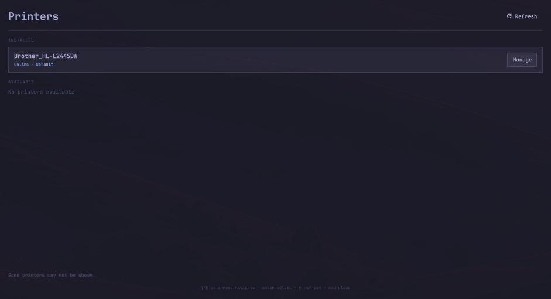

# Omarchy Printers

A keyboard-first Omarchy Shell printer widget. Its compact bar popup follows
the built-in Wi-Fi visual language for status and printer options; **Open
printer settings** opens the full management panel.



## Scope

- Driverless IPP/IPPS printers
- CUPS-discovered USB and network printers
- Locally installed CUPS drivers and PPDs
- Default printer, queue pause/resume, print jobs, printer defaults, test page,
  and queue removal

The plugin does not download vendor drivers, install packages, collect SMB
credentials, administer remote CUPS servers, or manage printer classes and
sharing.

## Requirements

Current Omarchy installations already include the required packages:

- `cups`
- `cups-pk-helper`
- `python-pycups`
- `python-dbus`

CUPS must be running. Privileged actions use the system CUPS PolicyKit helper
and Omarchy's existing authentication agent.

Opening the panel and using **Network scan** are read-only and do not request
administrator approval. **Full scan** searches all CUPS transports and may show
a PolicyKit prompt; cancelling it leaves installed and driverless printers
available.

## Install

Once this repository is published:

```bash
omarchy plugin add https://github.com/segersb/omarchy-printers.git --enable
```

For local development:

```bash
ln -s "$PWD" ~/.config/omarchy/plugins/segersb.omarchy-printers
omarchy-shell shell rescanPlugins
omarchy plugin enable segersb.omarchy-printers
```

## Open

Enabling the plugin adds its printer icon to the right side of the bar. Click
it for cached CUPS queue state and configurable defaults. Opening the popup
does not scan for printers. Its queue state updates when the widget starts and
after printer changes made through the full settings panel.

The full settings panel can also be opened directly:

```bash
omarchy-shell shell summon segersb.omarchy-printers '{}'
```

The full panel opens with installed printers only and never scans
automatically or periodically. Choose **Network scan** or **Full scan** to show
a **Detected** section containing that scan's current results.

To add it to the Omarchy menu, merge
[`docs/omarchy-menu.jsonc`](docs/omarchy-menu.jsonc) into:

```text
~/.config/omarchy/extensions/omarchy-menu.jsonc
```

The plugin installer intentionally does not run install hooks, so this menu
entry is opt-in.

## Update and remove

```bash
omarchy plugin update segersb.omarchy-printers
omarchy plugin remove segersb.omarchy-printers
```

## Keyboard controls

Quick popup:

- `j` / `k` or arrows: move through printers and defaults
- `Enter` or Space: activate
- `Esc`: close

Full settings:

- `j` / `k` or arrows: move
- `Enter` or Space: activate
- `r`: scan for driverless network printers
- `f`: scan all CUPS transports (may request administrator approval)
- `Esc`: go back or close
- Tab: move through form controls

The compact popup intentionally omits administrative actions such as adding,
removing, pausing, and printing a test page. Use **Open printer settings** for
the full panel.

## Development

```bash
./test
```

The backend emits versioned JSON on stdout and diagnostics on stderr. Its tests
use fake CUPS and D-Bus adapters and do not modify the host's printer setup.
See [`docs/architecture.md`](docs/architecture.md) for the trust boundary,
device identity rules, and driver-selection design.

### Local checks

```bash
./test
omarchy-shell shell summon segersb.omarchy-printers '{}'
journalctl --user --since "1 minute ago" --no-pager |
  rg 'omarchy-printers|PrinterPanel'
```

## Troubleshooting

- **No printers appear:** confirm CUPS is running with
  `systemctl status cups`.
- **A legacy printer is missing:** choose **Full scan** or press `f`, then
  approve the system prompt. Cancelling is safe.
- **A driver is missing:** install the vendor/CUPS driver package separately;
  this plugin only offers models already installed on the system.
- **An action is denied:** retry it and approve PolicyKit, or inspect the
  shell log using the command above.

## Safety

This plugin does not replace `system-config-printer`, alter desktop entries, or
change Chromium's printer-manager command.
